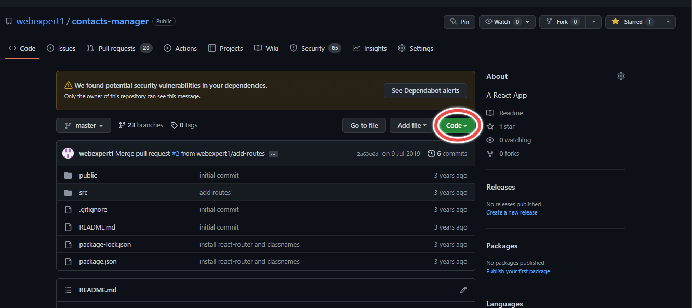
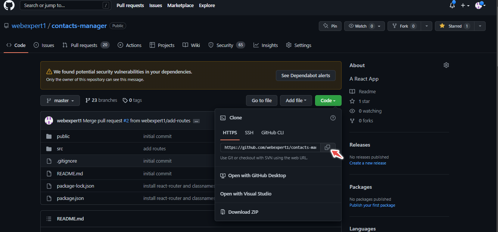
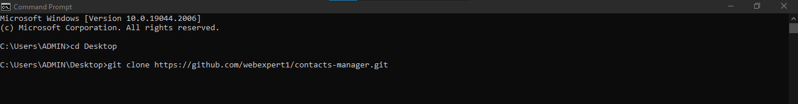

#   Introduction to GitHub

The table of content
1. Introduction
2. What is GitHub
3. Why GitHub
4. Git vs. GitHub
5. Clone (Show how to do cloning)
6. Pull request (Show how to do a pull request)
7. Commit (Show how to do a commit)
8. GitHub Desktop vs. Github CLI
9. Conclusion

##   Introduction
The fundamentals of Github are covered in this article. You will comprehend cloning, committing, pulling, and using Git and Github.

##   What is Github
GitHub is one of the most widely used platforms today for developers to exchange code, track changes, and collaborate on projects. Developers can advertise their work on this social networking site as well.

## Why GitHub
Github is used by so many businesses and developers for project sharing and collaboration.

## Git vs. GitHub
Git is free version control software that may be used to monitor any kind of file.
You may manage Git repositories using the cloud-hosted service GitHub.

<table>
   <thead>
      <tr>
         <th>Git</th>
         <th>GitHub</th>
      </tr>
   </thead>
   <tbody>
      <tr>
         <td>Git is free version control software that may be used to monitor any kind of file.</td>
         <td>You may manage Git repositories with the help of GitHub, a cloud-based service</td>
      </tr>
      <tr>
         <td>Your local machine often has Git installed.</td>
         <td>On a cloud, Github is housed.</td>
      </tr> 
   
   </tbody>
</table>
## Clone
A target repository is copied using the clone command.

- Github cloning instructions:
  -   Go to the main page of the repository on github.com.
  - Click on Code above the list of files.
  
  - Use HTTPS for cloning (SSH)
    
  - Copy the URL for the repository
  - Launch Git Bash, a command window on Windows, or a terminal (mac)
  - Type `git clone` and paste the URL.  
  - `git clone https://github.com/webexpert1/contacts-manager.git`
  -  

## Pull Request
Pull request let you tell others about the changes you've pushed to a branch in a repository on Github.

Here, here are the 
list of steps to do a pull request.

1. Click on pull request button
2. Choose the branch you want to merge

Click PUll request

## Commit

## Conclusion
